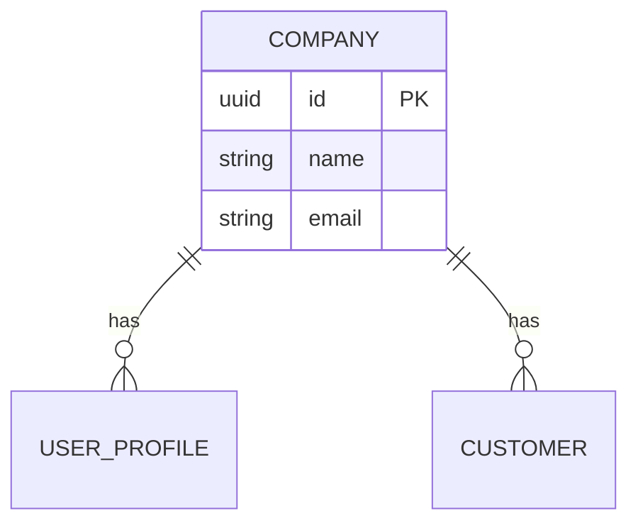

# ER Model Generator

## Quick Start

When triggered, scan the codebase for entity definitions and produce a Mermaid ER diagram.

## Workflow

Follow these steps in order:

### 1. Discover Entities

Scan these sources (in priority order) to find all data entities, their fields, and types:

- [ ] **SQL migrations** — `supabase/migrations/*.sql` or any `migrations/` directory. Look for `CREATE TABLE` statements. Extract column names, types, constraints (PK, FK, NOT NULL, UNIQUE, DEFAULT).
- [ ] **TypeScript interfaces/types** — search for `interface` and `type` declarations in `**/types/**`, `**/models/**`, `**/entities/**`. Extract field names and types.
- [ ] **Zod schemas** — search for `z.object` definitions in `**/schemas/**`. Extract field names and validation types.
- [ ] **ORM models** — if present (Prisma, Drizzle, TypeORM, Sequelize), scan schema/model files.

If multiple sources define the same entity, prefer SQL migrations as the source of truth for column types and constraints. Use TypeScript types to confirm field names and relationships.

### 2. Identify Relationships

For each entity, determine relationships by looking for:

- [ ] **Foreign keys** — `REFERENCES` clauses in SQL, `_id` suffixed fields in types
- [ ] **Join tables** — tables with two foreign keys and minimal other columns (many-to-many)
- [ ] **Nested/joined types** — optional fields typed as other entities (e.g., `customers?: { name: string }`)

Classify each relationship:
- `||--o{` = one-to-many (e.g., company has many users)
- `||--||` = one-to-one
- `}o--o{` = many-to-many (via join table)

### 3. Generate Mermaid ER Diagram

Produce a Mermaid `erDiagram` block with:

- All entities as blocks with their key fields (PK, FK, and important columns — skip `created_at`, `updated_at` unless relevant)
- All relationships with labels describing the connection
- Group related entities visually (core business entities first, then supporting tables)

**Output format:**

````markdown
# Entity-Relationship Model

> Auto-generated from codebase scan. Source of truth: SQL migrations.



## Entity Summary

| Entity | Source | Fields | Relationships |
|--------|--------|--------|---------------|
| Company | migrations/00001 | 12 | 6 outgoing |
| ... | ... | ... | ... |

## Notes

- [Any observations about orphaned tables, missing FKs, or inconsistencies]
````

### 4. Write Output

- Write the diagram to `docs/er-diagram.md` (or ask the user for a preferred location)
- If the file already exists, confirm before overwriting

## Advanced Features

See [REFERENCE.md](REFERENCE.md) for:
- Handling large schemas (50+ tables)
- Filtering entities by domain/module
- Comparing ER model against TypeScript types for drift detection
